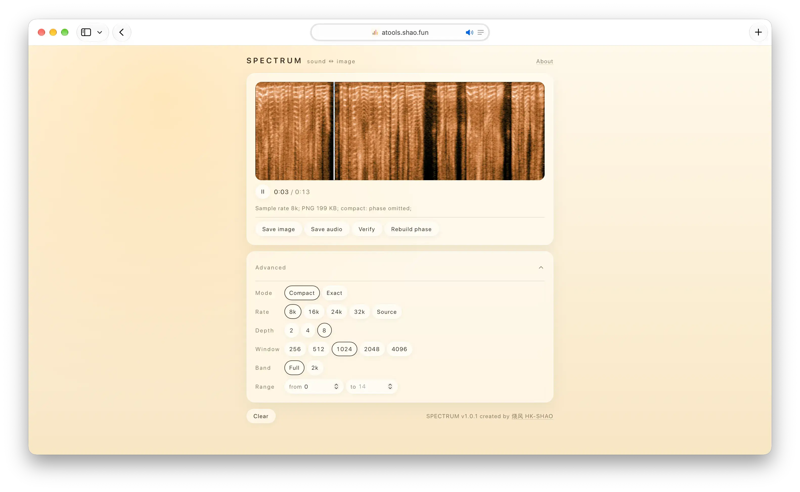

# Spectrum

[](https://github.com/HK-SHAO/atools/actions/workflows/ci.yml)

**[▶ Try online](https://atools.shao.fun)**



Turn audio into a shareable spectrogram; turn a spectrogram, or any picture, back into playable audio. The picture *is* the sound.

## How to use

Drop in an audio file (mp3, wav, flac, m4a, ogg, amr) to get a spectrogram; drop the image back to hear it. The spectrogram is the progress bar: click, drag, or use the arrow keys; playback starts wherever you land. The defaults suit most material; sampling, bit depth, window length, and range live under Advanced.

## Two modes

| | Compact (default) | Exact |
| -- | -- | -- |
| Stored | 2 / 4 / 8 bit magnitude | 8 bit magnitude + phase |
| Restored | phase reconstruction, approximate | near-lossless from the original PNG |
| After edits | still readable, quality depends on the pixels | degrades automatically when phase is damaged |

Compact images omit phase. They usually survive common sharing, compression, and resizing; the pixels that remain set the quality.

## Any image can play

The decoder adapts to what the image carries: it inverts intact phase directly, rebuilds damaged phase, and synthesises from an unfamiliar image as if it were a magnitude spectrum.

## MoonBit

The DSP kernel is a pure MoonBit package ([HK-SHAO/dsp](https://mooncakes.io/docs/HK-SHAO/dsp)): FFT (256–4096), STFT codec, quantization, and phase reconstruction, compiled to WASM and consumed directly in the browser with no JS runtime or server dependency. See [moon/README.md](moon/README.md) for the host ABI, memory layout, and design notes.

librosa is a Python analysis library; this project is a browser product and an image format for sound. They overlap in DSP but do not replace one another. Across all five window sizes, the STFT agrees with librosa 0.11.0 within `6.14e-16` relative error, and on three real recordings the default phase-reconstruction path beats `librosa.griffinlim()` at the same iteration budget on LSD, spectral convergence, and envelope. See the [scope](docs/algorithms.md#boundary-with-librosa) and [measurements](docs/metrics.md#librosa-cross-check).

## Development

```bash
bun install
bun dev              # source + HMR → http://localhost:3000
bun run test         # algorithm and format tests (bun test)
bun run build:web    # production build → dist/
```

## Going deeper

- [docs/architecture.md](docs/architecture.md): architecture and the gates
- [docs/algorithms.md](docs/algorithms.md): algorithm notes and benchmarks
- [docs/format-spec.md](docs/format-spec.md): image format contract
- [docs/metrics.md](docs/metrics.md): measured limits and performance
- [docs/build.md](docs/build.md): build, deploy, offline
- [AGENTS.md](AGENTS.md): engineering rules

## License

GPL-3.0. See [LICENSE](LICENSE).
