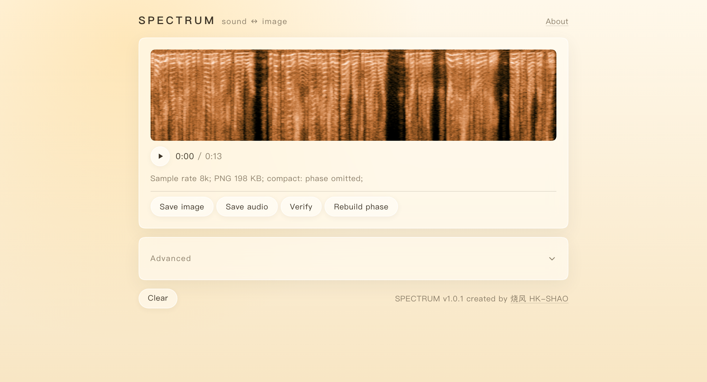

# atools · 频谱 Spectrum

**[▶ 在线试用 / Try online](https://www.bilibili.com/toy/atools/index.html)**



把音频变成一张可分享的频谱图；把频谱图，或随便哪张图片，还原成可播放的音频。图即是声音。

Turn audio into a shareable spectrogram; turn a spectrogram — or any picture at all — back into playable audio. The picture *is* the sound.

## 怎么用 / How to use

拖入一段音频（mp3、wav、flac、m4a、ogg、amr）得到频谱图；把图拖回去就能出声。频谱图本身就是进度条：点、拖、方向键，落到哪听到哪。

Drop in an audio file (mp3, wav, flac, m4a, ogg, amr) to get a spectrogram; drop the image back to hear it. The spectrogram is the progress bar — click, drag, or arrow keys, and it plays from wherever you land.

## 两种模式 / Two modes

| | 紧凑 Compact（默认 default） | 可逆 Exact |
| -- | -- | -- |
| 存什么 / Stored | 频谱幅度，2 / 4 / 8 bit 档位 | 16 bit 幅度 + 相位 |
| 大小 / Size | 几 KB ~ 几十 KB / KBs | 几百 KB / Hundreds of KBs |
| 还原 / Restored | 相位重建，音质接近原声 / near-original | 直接逆变换，近乎无损 / near-lossless |
| 抗折腾 / Survives | 随便转格式、缩放、截图 / survives anything | 相位段被破坏则降级 / degrades if phase lost |

紧凑模式的图就是频谱图本身，相位没存：随便转发、压缩、再编辑，工具照样能读。

A compact image is just the spectrogram — no phase stored — so it survives forwarding, compression and re-editing, and the tool still reads it.

## 陌生图片也能出声 / Any image can play

按图里幸存的信息自动选档：相位完好 → 近乎无损；本工具的图 → 幅度反查；被压缩或缩放过 → 自动降级；完全陌生的图 → 整张当幅度读。总有声音出来。

Reading adapts to what survived in the image: intact phase → near-lossless; our own images → amplitude lookup; compressed or rescaled → graceful degrade; a total stranger → read as raw amplitude. Something always plays.

## 开发 / Development

```bash
bun install
bun dev          # http://localhost:3000
bun test         # 算法与格式测试 / tests
bun run build    # 产物到 dist/ / build to dist/
```

## 深入 / Going deeper

- [docs/format-spec.md](docs/format-spec.md) —— 图片格式契约 / image format contract
- [docs/algorithms.md](docs/algorithms.md) —— 算法原理与实测 / algorithm notes and benchmarks
- [AGENTS.md](AGENTS.md) —— 工程架构 / engineering architecture
